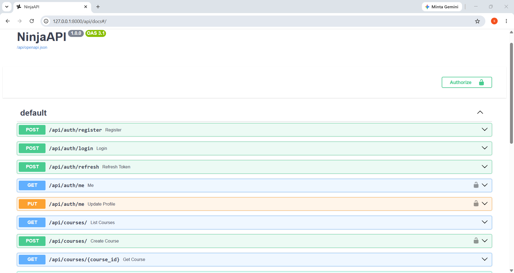

# Progress 3 - Simple LMS API (Django Ninja + JWT)

## Deskripsi

Proyek ini merupakan **Learning Management System (LMS)** berbasis **REST API** yang dibangun menggunakan **Django Ninja**. Sistem ini menerapkan autentikasi menggunakan **JSON Web Token (JWT)** dan **Role-Based Access Control (RBAC)** sehingga setiap pengguna memiliki hak akses sesuai dengan perannya.

## Tech Stack

* Python
* Django
* Django Ninja
* JWT (JSON Web Token)
* SQLite / PostgreSQL (opsional)
* Postman

## Fitur

### Authentication

* Register user
* Login menggunakan JWT
* Melihat data pengguna yang sedang login (`/me`)
* Update profil pengguna (`/me`)

### Courses

**Public Endpoint**

* GET `/api/courses` – Menampilkan daftar course
* GET `/api/courses/{id}` – Menampilkan detail course

**Protected Endpoint**

* POST `/api/courses` – Membuat course (Instructor)
* PATCH `/api/courses/{id}` – Mengubah course milik sendiri (Owner)
* DELETE `/api/courses/{id}` – Menghapus course (Admin)

## Authentication System

* Menggunakan JWT Access Token
* Password disimpan dengan hashing bawaan Django
* Mendukung tiga role:

  * Admin
  * Instructor
  * Student

## Permission System

* Menggunakan `require_role` untuk membatasi akses endpoint berdasarkan role.
* Melakukan validasi ownership sehingga hanya pemilik course yang dapat mengubah data course.

## API Endpoints

### Authentication

* `POST /api/auth/register`
* `POST /api/auth/login`
* `GET /api/auth/me`
* `PUT /api/auth/me`

### Courses

* `GET /api/courses`
* `GET /api/courses/{id}`
* `POST /api/courses`
* `PATCH /api/courses/{id}`
* `DELETE /api/courses/{id}`

## Cara Menjalankan

1. Clone repository.
2. Install seluruh dependency yang diperlukan.
3. Jalankan migrasi database.
4. Jalankan server Django.
5. Akses API melalui `http://localhost:8000`.

## Testing API

API dapat diuji menggunakan Postman dengan langkah berikut:

1. Import Postman Collection.
2. Login untuk mendapatkan JWT Access Token.
3. Tambahkan token pada header `Authorization` dengan format `Bearer <access_token>`.
4. Gunakan token tersebut untuk mengakses endpoint yang memerlukan autentikasi.

## Flow Sistem

`Register → Login → Generate JWT Token → Akses Protected API → Manajemen Course`

## Screenshot Swagger

```markdown

```
